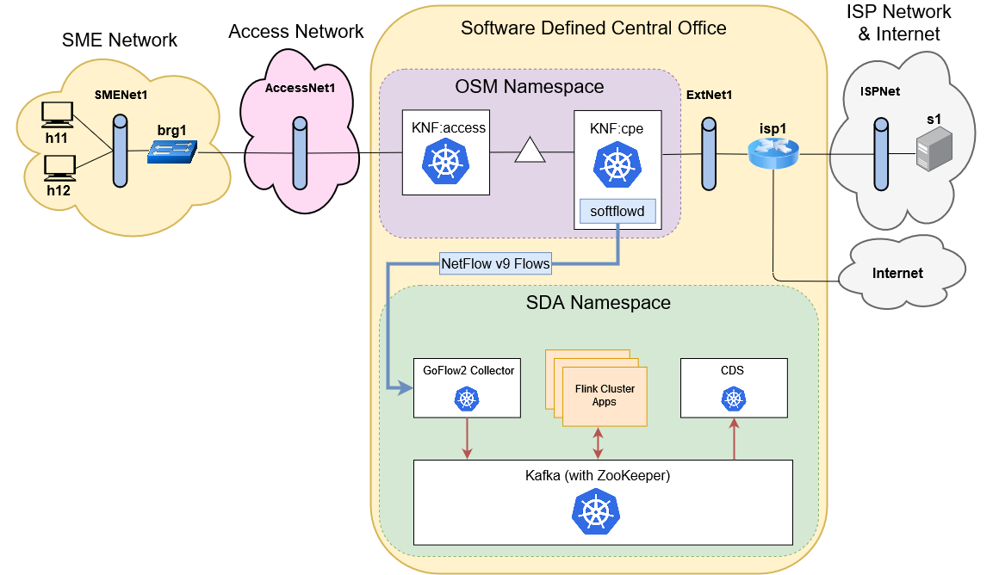
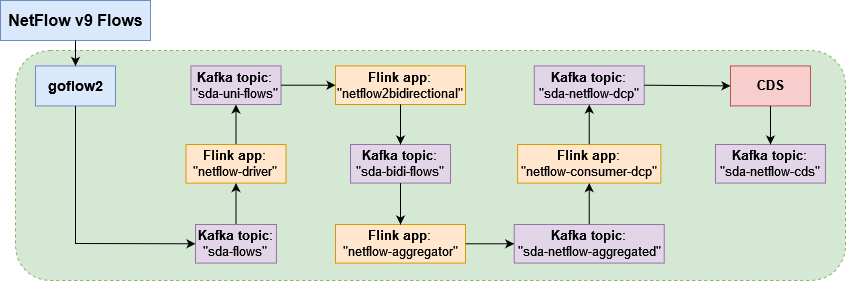

# nfv-lab-cds
Helm repository based on a [NFV laboratory practice](https://github.com/educaredes/nfv-lab) with [SDA+CDS](https://github.com/giros-dit/semantic-data-aggregator) integration, for demostrative purposes.




## Quick deployment and testing guide

0. Download _RDSV-K8S_ and _RDSV-OSM_ virtual machines.

You can download them from the following link: http://idefix.dit.upm.es/download/vnx/vm/.

1. Launch _RDSV-K8S_ and _RDSV-OSM_ virtual machines.

**NOTE**: Bear in mind that these virtual machines need more resources than the ones originally defined. A basic recommendation would be to set these machines to use, at least, 8 CPU cores and 12 GB of RAM.
For the _RDSV-K8S_ machine, install any required software, like _Helm_ or the standalone _kubectl_ util (and point it to the _MicroK8s_ cluster). Also, your Docker daemon must be configured to use a private repository, and this repository must contain all the custom images of the services that will be deployed. The following links give instructions to accomplish this:
- [Running Flink clusters in application mode on Kubernetes](https://github.com/giros-dit/semantic-data-aggregator/tree/develop/kubernetes/flink-operator).
- [Dockerfiles of services](https://github.com/giros-dit/nfv-lab-cds/tree/main/docker).
- [Working with a private Docker registry](https://microk8s.io/docs/registry-private).
- [Configuring the standalone _kubectl_ tool to point to a _MicroK8s_ cluster (you need this to use _Helm_)](https://microk8s.io/docs/working-with-kubectl).

You also need to build the image of the _vAccess_ and _vCPE_ KNFs/VNFs. You can find it [here](https://github.com/giros-dit/nfv-lab-cds/tree/main/img/vnf-img). Before building it, you must download the sample _PCAP_ with cryptomining traffic by executing the _script_ `download_pcap.sh`. After building it, push it to the private _Docker_ repository you enabled before.

2. On both machines open a terminal, clone the repository and change to its directory.

```
$ cd Desktop/
$ git clone https://github.com/giros-dit/nfv-lab-cds.git
$ cd nfv-lab-cds/
```

3. On _RDSV-K8S_, start the VNX scenarios.

```
$ cd vnx/
$ ./vnx_create_all.sh
```

4. On _RDSV-K8S_, launch all SDA+CDS-related services.
```
$ cd ../kubernetes/
$ cd test-services/
$ kubectl apply -f zookeeper.yaml
$ kubectl apply -f kafka.yaml
$ cd ../netflow-sda-cds-full-pipeline/
$ helm install -f values.yaml netflow-sda-cds-full-pipeline .
```

5. On _RDSV-OSM_, add this _Helm_ chart repository to OSM. To do so, open _Mozilla Firefox_ on this machine, open http://localhost and login to the OSM GUI with the following credentials: admin/admin (they are already configured and saved by default). Once logged in, navigate to the menu on the left-side of the interface and go to _K8s_ -> _K8s Repos_. Then, click on the button _Add K8s repository_ and fill in the form with the following information:
```
Name: helmchartrepo
Type: Helm Chart
URL: https://giros-dit.github.io/nfv-lab-cds
Description: Type a short, descriptive phrase.
```

6. On _RDSV-OSM_, onboard the VNF and NS descriptors using the same GUI: navigate to _Packages_ -> _VNF Packages_ and _Packages_ -> _NS Packages_.

7. Once the onboarding has completed, open a terminal in _RDSV-OSM_ and instantiate a network service with the following command:
```
$ osm ns-create --ns_name renes1 --nsd_name renes --vim_account dummy_vim
```
You can check the instantiation status with `watch osm ns-list`. If an error appears during the instantiation (likely), delete it from the GUI (menu _Instances_ -> _NS Instances_) and repeat the instantiation command. This time it should complete successfully.

8. After the instantiation, configure the NS. On _RDSV-OSM_, open a terminal and execute the following commands.
```
$ cd Desktop/
$ cd nfv-lab-cds/scripts/
$ export OSMNS=7b2950d8-f92b-4041-9a55-8d1837ad7b0a
$ ./osm_renes1.sh
```

9. Go to _RDSV-K8S_ and, with _kubectl_, execute the _bash_ command on the _kafka_ pod to open a console. Then, use the `kafka-console-consumer.sh` script to print all the messages written to the `sda-netflow-cds` topic. You can open the XFCE console of _h11_ and generate some network traffic. After several seconds, you should be able to see some messages. You can inject the sample _PCAP_ file with cryptomining traffic. To inject this _PCAP_, on _RDSV-OSM_ execute the following command:
```
$ ./softflowd_inject_pcap.sh
```
If you open the _Kafka_ console you should be able to see more messages.
